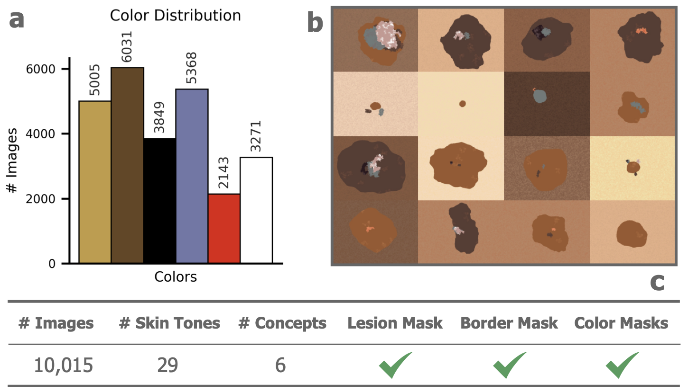

# SynSkin: A Synthetic Skin Lesion-Like Dataset for Benchmarking Dermoscopic Color Concepts

## 📂 SynSkin

<p align="center"></p>

The SynSkin dataset consists of 10,015 images, each annotated with six image-level color labels: red,white, blue-gray, light-brown, dark-brown, and black. Each image is paired with binary masks indicating the lesion region, lesion border, and the presence of each annotated color.

## ⚡️ Highlights 🔥  
- Multilabel color classification;
- Border, lesion and color segmentation;
- Assessing explainable models (e.g., concept-based explanations).

## 📊 Dataset Structure
Number of samples: 10,015
File format(s): .PNG
Size: 738 MB

### Images
- Format: `.jpg`
- Number of images: 10015
- Naming convention: `<IMAGE_ID>_synthetic.jpg`

### Masks
- Format: Binary masks in `.png`
- One mask per color per image
- Naming convention: `<IMAGE_ID>_color_<COLOR>.png`

### Metadata
- `annotations_synskin_colors.csv`: Contains color image annotations
- `synskin_{train,val,test}.csv`: Train/validation/test splits

```kotlin
dataset/
├── images/
│   ├── SYNSKIN_<IMAGE_ID>
│   │   ├── SYNSKIN_<IMAGE_ID>_synthetic.jpg
│   │   ├── SYNSKIN_<IMAGE_ID>_color_mask_<COLOR>.png
│   │   ├── SYNSKIN_<IMAGE_ID>_border_mask.png
│   │   └── SYNSKIN_<IMAGE_ID>_lesion_mask.png
│   └── ...
├── metadata/
│   ├── synskin_train.csv
│   ├── synskin_val.csv
│   ├── synskin_test.csv
│   └── annotations_synskin_colors.csv
```

## 🧾 Metadata
| Column | Description |
|--------|-------------|
| ID | Image ID  |
| light_brown | Binary label (1) is present (0) is absent |
| dark_brown | Binary label (1) is present (0) is absent |
| black | Binary label (1) is present (0) is absent |
| blue-gray | Binary label (1) is present (0) is absent |
| red | Binary label (1) is present (0) is absent |
| white | Binary label (1) is present (0) is absent |

## 👨🏻‍💻 Usage

Download dataset:

```bash
git clone https://github.com/CristianoPatricio/synskin-dataset/
```

Dataloader (PyTorch):

```bash
python synskin_dataloader.py
```

## 🙌 Citation

If you use this dataset, please cite:

```bash
@inproceedings{patricio_synskin_2025,
  title={Towards Concept-based Interpretability of Skin Lesion Diagnosis using Vision-Language Models},
  author={Patr{\'\i}cio, Cristiano and Teixeira, Lu{\'\i}s F and Neves, Jo{\~a}o C},
  booktitle={31th Portuguese Conference on Pattern Recognition (RECPAD)},
  year={2025}
}
```
